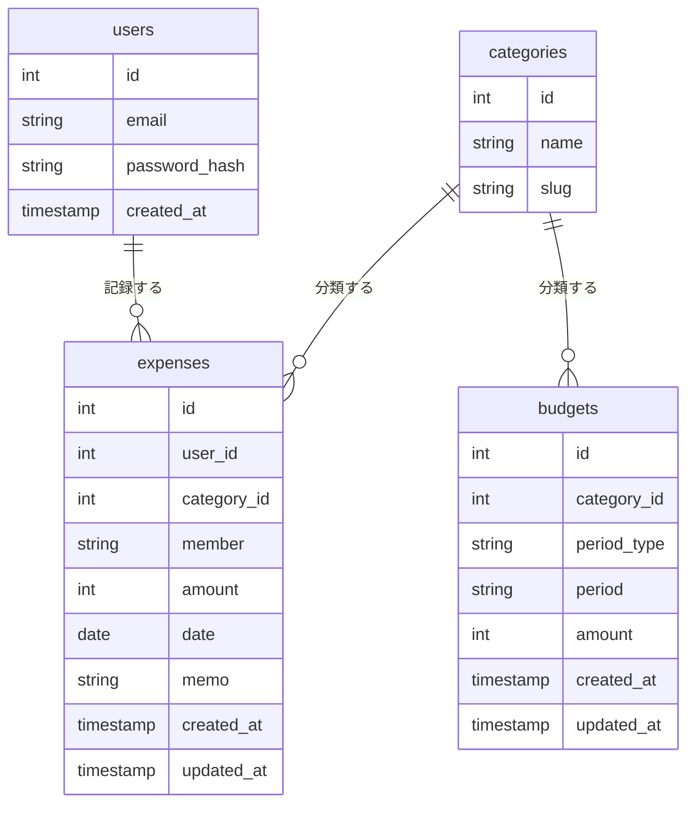

# DB設計

## ER図

## カラム定義

### users
| カラム | 型 | 説明 |
|--------|----|------|
| id | int | PK |
| email | varchar | ログイン用メールアドレス |
| password_hash | varchar | ハッシュ化済みパスワード |
| created_at | timestamp | 作成日時 |

### categories
| カラム | 型 | 説明 |
|--------|----|------|
| id | int | PK |
| name | varchar | 表示名（例：食費） |
| slug | varchar | 識別子（例：food） |

### expenses
| カラム | 型 | 説明 |
|--------|----|------|
| id | int | PK |
| user_id | int | FK → users.id |
| category_id | int | FK → categories.id |
| member | enum | `husband`（夫）/ `wife`（妻） |
| amount | int | 支出金額（円） |
| date | date | 支出日 |
| memo | varchar | メモ（任意） |
| created_at | timestamp | 作成日時 |
| updated_at | timestamp | 更新日時 |

### budgets
| カラム | 型 | 説明 |
|--------|----|------|
| id | int | PK |
| category_id | int | FK → categories.id |
| period_type | enum | `week` / `month` |
| period | varchar | 週: `2026-W19`、月: `2026-05` |
| amount | int | 予算金額（円） |
| created_at | timestamp | 作成日時 |
| updated_at | timestamp | 更新日時 |
