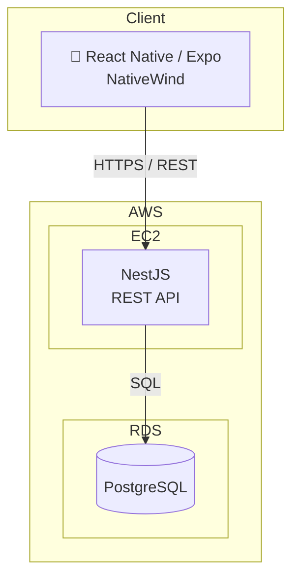

# アーキテクチャ

## 構成概要

| レイヤー | 技術 | 役割 |
|----------|------|------|
| Frontend | React Native (Expo) + NativeWind | モバイルアプリ（iOS / Android） |
| Backend | NestJS (TypeScript) | REST API サーバー |
| DB | PostgreSQL | データ永続化 |
| Infra | AWS EC2 | バックエンドホスティング |
| Infra | AWS RDS | DBホスティング |
